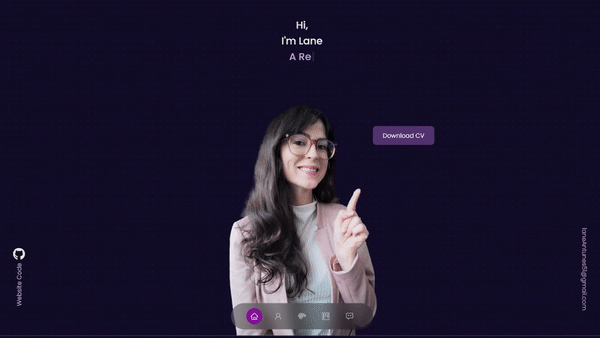

## Hey there! I'm Lane Antunes. 

<h3> 👨🏻‍💻 &nbsp;About Me </h3>

👋 After almost a year of professional experience, my enthusiasm for front-end web development continues to grow. I've honed my skills in JavaScript and React, and I'm currently exploring more advanced techniques and tools to enhance my projects.

🎯 Current Goals:

Master advanced React patterns and state management.
Expand my portfolio with projects that demonstrate both functionality and innovative design.

🚀 What I'm Up To:

Actively contributing to web and mobile applications with clean, efficient code.
Available to collaborate on exciting new projects for 5-15 hours per week.

Let’s build something amazing together!

<h3> 🛠 &nbsp;Tech Stack</h3>

- 🌐 &nbsp;
  
  
  
  
  
  
  
- ⚙️ &nbsp;
  
  
  
- 🔧 &nbsp;
  
   <!-- If no badge exists, you might use a generic Redux Toolkit badge -->
  

 

 

<h3> 🤝🏻 &nbsp;Connect with Me </h3>

